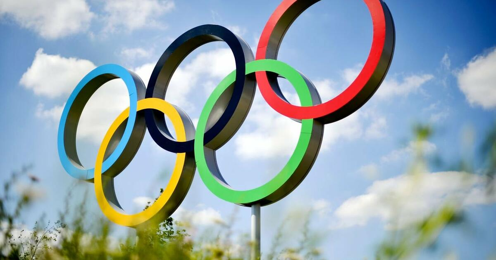

# Olympics SQL & Streamlit Interactive Dashboard  

**Objective:**

Design, implement, and analyze a relational database of Olympic Games data using SQL, and extract actionable insights on athlete participation, country performance, and medal trends through queries of varying complexity (basic, intermediate, advanced).  

**Workflow:**  

### ERD Design --> Database Creation --> Data Loading --> Query Development --> Visualization & Insights  

- Follow the detailed workflow and analysis in the project notebook: [Open Full Notebook](notebook.ipynb)  

**Tech Stack:**  

MySQL, Python, Pandas, NumPy, Streamlit, Plotly  

**Visualization:**  

 - Interactive Streamlit dashboard displaying athlete participation, medal distribution, age trends, top countries, and historical medal trends.

**Author:** Liliia Rastorhuieva

